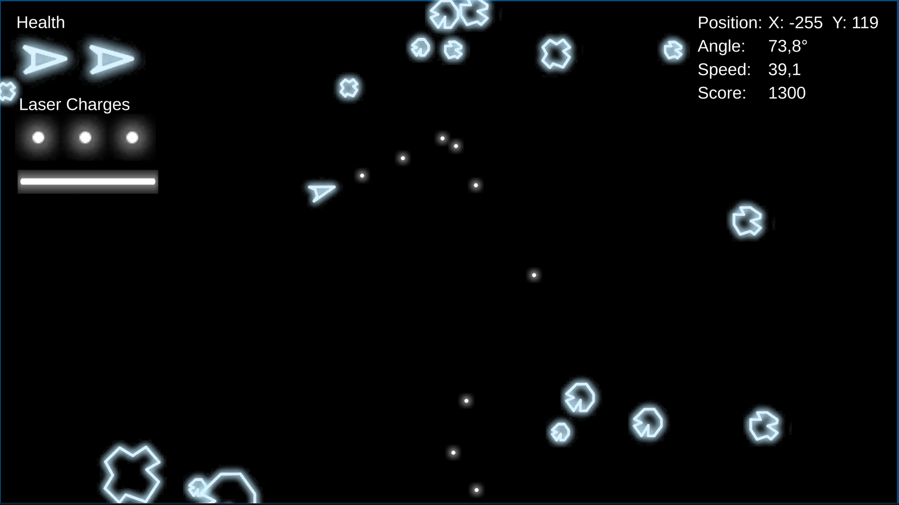

# Asteroids

2D-клон классической аркады Asteroids, разработанный на Unity 2022.3.9f1

---

## Геймплей

- Корабль управляется с инерцией и ускорением
- Астероиды и летающие тарелки уничтожаются за очки
- Астероиды разлетаются на обломки при попадании пули
- Тарелки преследуют игрока
- При столкновении - рикошет и 3 секунды неуязвимости с эффектом частиц
- Два вида оружия: пули и лазер с ограниченными зарядами
- Мир с порталами на границах
---

## Архитектура

Проект построен на строгом разделении логики

### Assembly Definitions

| Сборка | Содержимое |
|---|---|
| `Asteroids.Core` | Интерфейсы, сигналы, типы, конфиги |
| `Asteroids.Infrastructure` | Физика, пулы, фабрики, сервисы, загрузчики |
| `Asteroids.Gameplay` | Корабль, враги, оружие, стейты, паттерны |
| `Asteroids.Analytics` | Firebase Analytics, Yandex Mobile Ads |
| `Asteroids.App` | GameInstaller, GameSceneInstaller (Composition Root) |
| `Asteroids.UI` | MVVM: вью и вьюмодели |

### Стек

- **Zenject** - DI-контейнер, SignalBus
- **UniTask** - асинхронность 
- **MVVM** - все UI-экраны через ViewModel + SignalBus
- **Кастомная физика** - `Rigidbody2D` используется только в режиме `Kinematic` для коллайдеров
- **Firebase Analytics** - логирование событий
- **Yandex Mobile Ads** - монетизация через рекламу
---

## Управление

| Тип | Описание |
|---|---|
| Клавиатура | `W` - тяга, `A/D`  - поворот, `Space` - выстрел, `LShift` - лазер, `Esc` - пауза |
| Геймпад (Xbox/PS5) | Левый стик - движение и поворот, `Fire1` - выстрел, `Fire2` - лазер, `Options/Start` - пауза |
| Виртуальный джойстик | Мобильное управление: стик, кнопки SHOOT / LASER / PAUSE |

Переключение типа управления доступно в меню паузы. Геймпад определяется автоматически при подключении.
 
---

## Конфигурация

Параметры хранятся в JSON-файлах в `StreamingAssets/Configs/` - можно менять без перекомпиляции.

**`ship_config.json`** - параметры корабля: HP, скорость, drag, параметры пуль и лазера  
**`enemy_config.json`** - параметры врагов по типу: скорость, радиус, награда, количество обломков  
**`world_config.json`** - размер мира, отступ спавна, лимиты врагов, интервалы спавна
 
---

## Физика

Вся физика написана вручную без использования `Physics` и `Rigidbody` в Dynamic режиме

- **`PhysicsBody`** - позиция, скорость, радиус, слой коллизий
- **`CollisionMatrix`** - матрица `4×4` определяет кто с кем коллидирует (Ship, Enemy, Bullet, Laser)
- **`CollisionDetector`** - проверяет пересечения коллайдеров и генерирует события столкновений
- **`CollisionResolver`** - обрабатывает столкновения, рассчитывает рикошет и применяет эффекты
- **`PhysicsWorld`** - управляет всеми телами, обновляет позиции, обрабатывает коллизии и рикошеты
---

## Аналитика и реклама

- **Firebase Analytics** — логирует старт игры, конец игры, уничтожение врагов, выстрелы лазером, майлстоуны счёта, события рекламы
- **Yandex Mobile Ads** — полноэкранная реклама каждые 2 смерти, rewarded за продолжение с 1 HP, баннер в паузе
---

## Требования

- Unity 2022.3.9f1
- Android API 23+ для мобильного билда
- Target SDK 34
---

## Запуск

1. Клонировать репозиторий
2. Открыть в Unity 2022.3.9f1
3. Открыть сцену `Bootstrap`
4. Запустить в Play Mode или собрать билд
   
> Для Android билда с рекламой и аналитикой:
> - `google-services.json` положить в `Assets/`
> - `FIREBASE_ENABLED;YANDEX_ADS_ENABLED` добавить в Scripting Define Symbols (Android)